- [About Book](#about-book)
- [Bits, Bytes, Numbers, Characters](#bits-bytes-numbers-characters)
- [Files and Processes](#files-and-processes)
- [Commands](#commands)
  - [Arguments](#arguments)
  - [Standard Input, Standard Output, Redirection and Piping](#standard-input-standard-output-redirection-and-piping)
  - [Absolute Paths, Relative Paths, Current Working Directory](#absolute-paths-relative-paths-current-working-directory)
  - [Spaces in arguments](#spaces-in-arguments)
- [File/Directory Permissions and Users/Groups](#filedirectory-permissions-and-usersgroups)
- [Commonly Used Commands](#commonly-used-commands)
  - [pwd](#pwd)
  - [ls](#ls)
  - [cd](#cd)
  - [locate](#locate)
  - [find](#find)
  - [grep](#grep)
  - [sudo](#sudo)
  - [chown](#chown)
  - [chmod](#chmod)
- [Terminology](#terminology)

# About Book
This (mini) book teaches you about the *fundamentals* of linux. 
1. It assumes you are an absolute beginner (thus everything will be taught, nothing will be assumed). 
2. Only the really important and very commonly used concepts/tools will be covered.
3. You will get enough of a foundation to be able to discover and learn additional concepts/tools by yourself.

# Bits, Bytes, Numbers, Characters
Computers only deal with numbers, but we often need them to deal with text, so how does that happen? 

As just mentioned, computers only store numbers. They store numbers as sequencies of 0s and 1s. Each 0 (or 1) is refered to as a `bit`. If you group 8 of these bits together, you get a `byte`. 

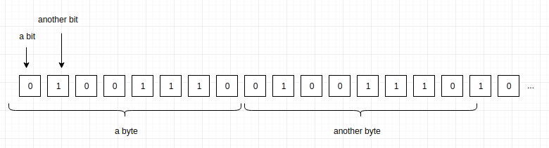

A byte can have many different patterns of 0s and 1s. Here are just a few examples:

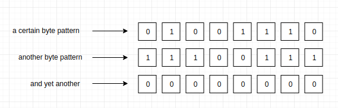

You can assign a number to each pattern. 

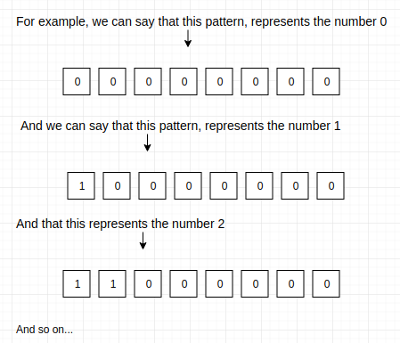

Now, you can think of the sequence of 0s and 1s (bits) as numbers, because each byte pattern represents a certain number. We can go a step further, and assign a character to each number. For example, we can say that the number `1` represents the character `a`, the number `2` represents the character `b`, the number `3` represents the character `c`, and so on.

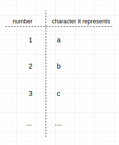

Thankfully, you don't make your own mapping of byte patterns to numbers and numbers to characters. There is already an established way of mapping byte patterns to numbers and an established way of mapping numbers to characters. It isn't worth your time to take a look at which byte patterns are mapped to which numbers, but you may want to take a quick peek at what numbers are mapped to what characters:

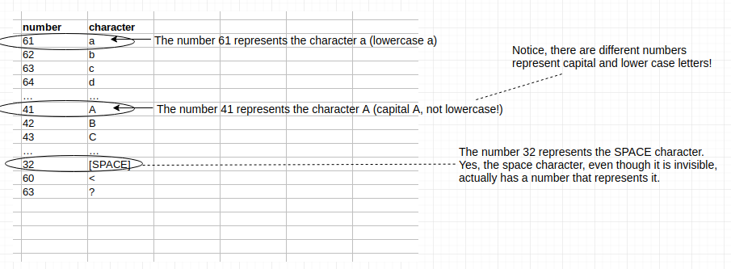

The mapping above, is called the ASCII encoding. If you are interested to see all the characters ASCII supports and the numbers that represent them, google "ascii table". 

The reason why a standard mapping of numbers to characters exists is to make communication easier. For example, if I want to create a file with the sequence of characters `abdullah` in it, how would I do that? Remember, computers can only store 0s and 1s (aka bits). Well, we know that we can group bits into bytes (groups of 8 bits), and we know that each byte pattern represents a different number. So now, we have a way of storing numbers in a file. How can we store characters? We go to the ASCII table, and for each of our characters, we find the associated number, and store that number in the file! When we give our file to someone else, they look at each number, go to the ASCII table, and find the associated character. So they go from a bunch of numbers, back to `abdullah`. Thankfully, this whole thing is automated, text editors and viewers do this for you automatically. When you type in a text editor, it is actually storing numbers in the file. When you view a file in a text viewer, it is taking each number in the file, and looking into the ASCII table to see which character that number represents, and then it is drawing that character for you!

Why did we have this entire discussion if this whole process is automated for you? Because *understanding* how it works, just like understanding how almost anything works, is *very* fruitful. Just keep in mind that computers (and thus files) can only store numbers! That's it! But if people agree to interpret the numbers as characters (according to the ASCII table), then you can think of the file as storing characters, even though it is really storing numbers!

Phew! That was long, but I hope the concept and the final message (that computers can only store numbers, but you can interpret the numbers how ever you want) is easy to grasp! One more thing, a sequence of characters, like `abdullah`, is more commonly refered to as a **string**. Remember this term, you will see it *everywhere*.

# Files and Processes
There are 2 places where a computer can store bits. Disk or RAM. Disk is a lot bigger, but RAM is a lot faster. So in other words, I can store a lot more things on disk, but accessing those things is much slower.

A file is just a sequence of bits on *disk*. If the person who created the file put in byte patterns that can be interpreted as a string, then we say it is a **text file**. Otherwise, we say it is a **binary file**. **Executable files**  are binary files that contain instructions that your computer can follow. 

When you "launch" an executable file, the file is copied from disk to RAM, and then your computer (more specifically, your CPU) starts doing the instructions that were in the file. Why is it copied to RAM before the CPU starts following the instructions? Because the CPU can read the instructions off RAM much faster than off disk. The copy of the file's content on RAM is called a **process**. This is why some people say that a process is a running instance of a file. Because a file just sits there on disk, where as a process (the copy of the file on RAM) is actually being executed (aka the instructions are being followed) by your CPU.

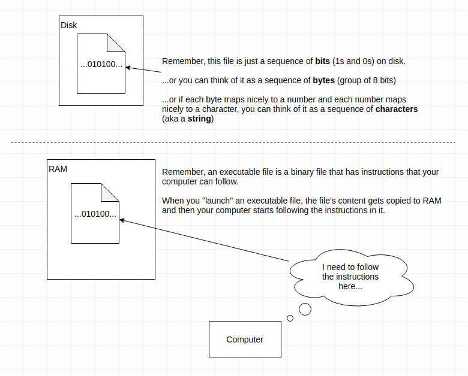

# Commands
When you are executing commands, you are actually launching executable files. In other words, you are creating processes (remember that the copy of an executable file on RAM is called a process). Each command, is actually the name of an executable file somewhere on your disk that will be launched when you execute the command. For example, executing the `pwd` command will launch the `/bin/pwd` executable file.

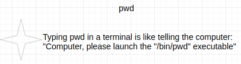

## Arguments
Recall, that when you launch an executable, you are basically copying the executable file to RAM, and then telling the CPU to follow the instructions in the copy of the file on RAM. Even though the process is just instructions, and the CPU is actually the one following it, people often like to think that the process is actually doing stuff (using the CPU). This is a common perspective to take, and so we will take it now. Before a process starts (i.e. before the CPU starts following its instructions), it is useful to tell most processes some more information on how to behave, what to do, or what data to operate on.

We tell a process what to do or how to behave by giving it a bunch of strings, each string is called an **argument**. Each argument effects some aspect of how the program behaves.

For example, consider launching the `cd` process. The first argument to the cd process tells it what directory to change to.

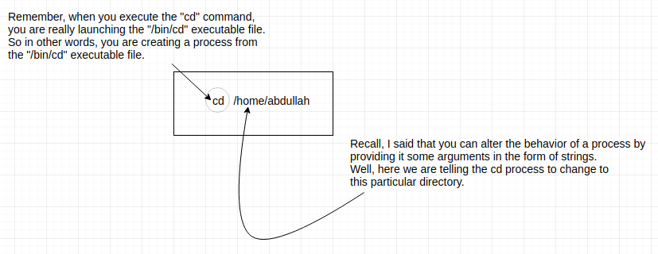

## Standard Input, Standard Output, Redirection and Piping
Most processes operate on some data and then produce some data. We call the data that it operates on **input** and the data it produces **output**. 

There are two ways to provide data to your process.
1. By putting the data into a file, and then passing the *path* of the file as an argument to the process.
2. By putting the data into the processe's **standard input** (or **stdin** for short).

A processe's standard input is just a conceptual place you can put data into, and the process will read it from there.
A processe's **standard output** is just a conceptual place that the process will put data (i.e. a place the process stores its output).

Here is an example of feeding a process data by passing a file path to the data file as an argument.

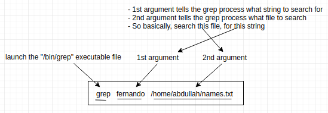

When you execute a command, and you see a bunch of text in the console window, that is the output of the launched process. The standard output of launched processes are by default the terminal window. But you can redirect it. For example, let's redirect the output of the `ls` command to a file called `/home/abdullah/the_output.txt`:

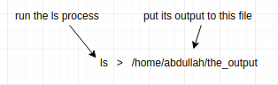

Notice, if you want to redirect the output of a command, just add `> /path/to/file` after the command (and all of its arguments).

You can actually take the output of one command (process) and put it as the input of another command (process). 

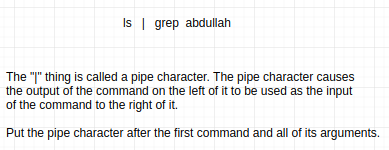

Let's disect what we are doing above. We are launching the `ls` process, giving it no arguments, but connecting its output to the input of the `grep` process (which we launch as well). We give the `grep` process an argument. The 1st argument of grep specifies the string to search. Where does `grep` search? It searches its standard input. The standard input of `grep` in this case is simply the output of the `ls` command. Thus we are effectively searching the output of the `ls` command for the string `abdullah`.

Piping is a really powerful way of "connecting" or chaining commands. You can have some data flow through several processes, each process doing something with it. You can think of it like an assembly line of processes.

## Absolute Paths, Relative Paths, Current Working Directory
All files and directories (directories are also called folders) on disk have a path. For example, if our disk directory structure looks like the following:

- bin (a directory)
    - grep
    - ls
    - pwd
- home (a directory)
    - abdullah (a directory)
        - names.txt

Every line above is either a directory or a file. If it is a directory, I have stated so, otherwise it is a file.

The full path to the above `grep` file is `/bin/grep` because it is inside the bin folder. The full path to the `names.txt` file is `/home/abdullah/names.txt`.

Every process, has what is known as a **current working directory** (sometimes simply called a *working directory*). Your terminal (aka console) is a process as well. Your terminal is a process that allows you to execute other processes (recall, when you execute a command in a terminal, you are simply launching an executable with the same name as the command! Please don't forget this!). Since every process has a working directory, and your terminal is a process, it too has a working directory.

To view your terminals current working directory, execute the `pwd` command.

Recall, that some processes take arguments (in the form of strings). Some processes expect their argument to be a path to a file or directory (because the process plans on doing something with the file or directory). I will call these type of arguments "file arguments". There are two ways you can specify a file argument to a command.
1. You can write the full path of the file or directory.
2. You can write the path of the file or directory *relative* to the current working directory of your terminal.

The `ls` command lists the contents (files and directories) of a target directory (which is specified via the 1st argument). You can specify the target directory using a full path or a relative path. By relative path, I mean a path that assumes your starting location is the current directory of your terminal. This will be clear in a moment, for now just move on.

Here is an example of how you'd specify a full path to the Documents directory:

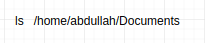

And here is an example of how you'd specify a relative path to the Documents directory (assuming our terminal's current working directory is `/home`):

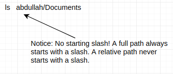

The first approach, says "start at the root of the directory structure, then go to the `home` directory, then to the `abdullah` directory, then to the `Documents` directory.

The second approach says "start at the current directory of the terminal (which is `home` in this case), then go to the `abdullah` directory, then to the `Documents` directory. 

Notice that regardless of which method (full path or relative), you got the same results. So, as long as your relative path is correct, both ways will give you the same results!

## Spaces in arguments
If you need to put spaces in an argument you are passing to a command, put quotes around the whole argument. 

~~~~~~~~~~~shell
echo "hello there mate"
~~~~~~~~~~~

Simple as that. `hello there mate` is a single argument to the `echo` command. If we did not put the quotes around it, it would be treated as 3 seperate arguments. 

# File/Directory Permissions and Users/Groups
In linux, you can have many **users** (each with a username and id). Files and directories *belong* to a user. The **owner** of the file/directory is the user that the file/directory belongs to. Users can be part of a group.

A file/directory has permissions. The permissions of a file/directory specify what various people can do with the file/directory. For example, a user can have read permission (can view the file), write permission (can edit the file), and execute permission (can make a process from the file). For each file/directory, you can specify what permissions the owner has, what permissions members of the owner's group has, and what permissions everyone else has.

You can use `ls -l` (the `ls` command with `-l` argument) to view the permissions of files/directories in the current working directory:

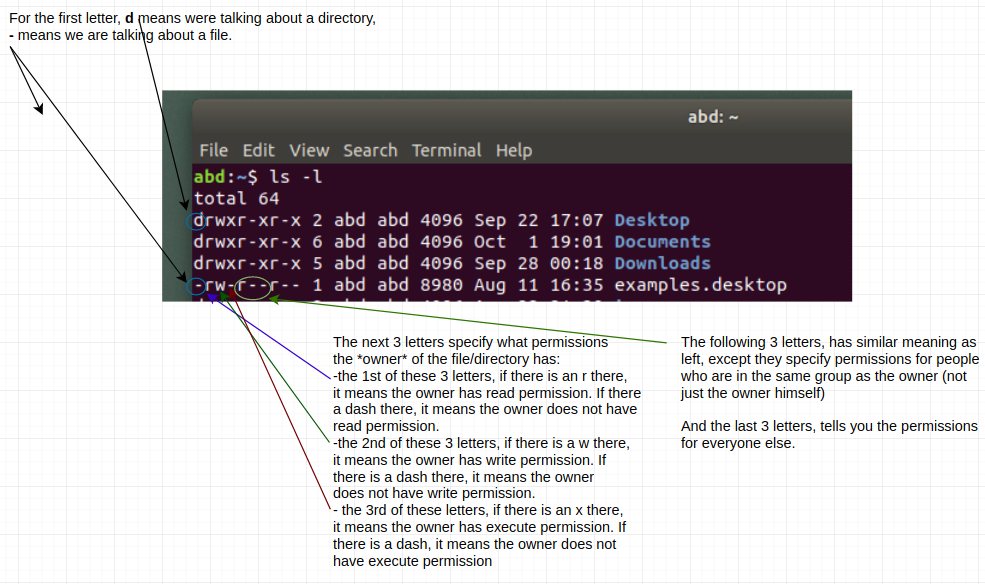

In a later section, we will show you how to change the owner or permissions of a file/directory.

# Commonly Used Commands
You now understand that executing commands is basically creating a process from an executable file (and giving it some arguments in the form of strings). You also know that a lot of commands take an argument that should specify a file or directory. You know that in this case, you can pass either a full path or a relative path to the file/directory. Furthermore, you know that some commands take input data from standard input and spit output data to standard output. You also know that you can redirect the output of a command to a file or as the input of another command!

That's a lot that you've learned! Now, let's put it all together, have some fun, and use some commonly used commands.

## pwd
The `pwd` command outputs (to standard out ofcourse! Anytime I say a command outputs, it is always to standard out, but you can ofcourse redirect it!) the current working directory of your terminal.

## ls
The `ls` command can list (i.e. outputs) the files and directories in a target directory.

If you use it with no arguments, like so: `ls`, it will output all the files and directories that are in the current working directory of your terminal. 

You can pass a `-a` argument to even show hidden files/folders (hidden files/folders are those that begin with a dot, they are not displayed by ls by default):

~~~~~~~~~~~shell
ls -a
~~~~~~~~~~~

You can pass a `-l` argument to output more information (such as size, modification date, owner) on each file/directory it lists.

~~~~~~~~~~~shell
ls -l
~~~~~~~~~~~

You can pass both the `-a` and `-l` arguments (in any order) to get both effects!

~~~~~~~~~~~shell
ls -a -l
~~~~~~~~~~~

By the way, usually commands don't care what order you pass arguments that begin with a *dash*. They do care about the order of arguments that do not have a dash.

## cd
The `cd` command changes your terminal's current working directory to a target directory.

Let's say that my terminal's current working directory is `/home`, doing:

~~~~~~~~~~~~~shell
cd /home/abdullah/Documents
~~~~~~~~~~~~~

Makes my terminals current working directory be `/home/abdullah/Documents`. 

Instead, I could have done:

~~~~~~~~shell
cd abdullah/Documents
~~~~~~~~

And gotten the same effect! Think back to what I said about full versus relative paths! Hint: Arguments that represent a file or directory path, can be specified as full or relative paths. A full path begins with a slash, and it says "start at the root of the directory structure". A relative path does not begin with a slash and it says "start at the terminal's current working directory."

This is a good place for me to show you another little trick with specifying paths. You can use the `..` string to mean "go up one directory". So for example, if my current directory is `/home/abdullah` and I do:

~~~~~~~~~shell
cd ..
~~~~~~~~~

My current directory will change to `/home` (because going "up" one directory from `abdullah` gives us the parent directory `home`).

You can get fancy with using `..`, for example:

~~~~~~shell
cd ../fernando
~~~~~~

The above path is specified by saying "starting at the terminal's current working directory, go up one directory, then go down to a directory called `fernando`.

## locate
The `locate` command can be used to find files with a specified name. 

Let's say we wanted to find all files in our computer that have the string "password" in their name (i.e. find all files whos name has "password" in it). We can:

~~~~~~~shell
locate password
~~~~~~~

There is one little catch. `locate` searches a database, not your actual file system. You don't really need to know where the data base is or any of those details (you can google that yourself if you are interested though). All you need to remember is, if you add new files, those files will not be found by `locate` unless you run `sudo updatedb`.

So basically, anytime you add or delete files from your computer, you should run `sudo updatedb`.

Since locate searches a database, it is VERY fast. But since it searches a database, if the file hasn't been entered into the database (by running `sudo updatedb` after the file was added), it will not be found!

## find
If you don't care for the blazingly fast speed of locate, you can use the `find` command for the same purpose without having to update a database. The find command actually searches your computer, not a database.

~~~~~~~shell
find /home/abdullah/Documents -name passwords
~~~~~~~

The above will find all the files named `passwords` that resides in the directory `/home/abdullah/Documents`.

## grep
`locate` and `find` search file names (i.e. if you want to find files with certain names), `grep` searches file content. In other words, you can use `grep` to find certain lines of a file that contain some string of interest.

~~~~~~shell
grep cool /home/abdullah/log.txt
~~~~~~

The above command will search the file `/home/abdullah/log.txt` for any lines that contain `cool`, and it will output just those lines.

You can pass in multiple files to search:

~~~~~~shell
grep cool /home/abdullah/log.txt /home/fernando/my_file.txt
~~~~~~

The above command will search 2 files (`/home/abdullah/log.txt`, `/home/fernando/my_file.txt`) for lines containing `cool`. You can pass in as many files as you want.

This is a good chance for us to practice piping the output of one command as the input of another.

~~~~~~~shell
ls | grep abdullah
~~~~~~~

Before I explain what the above does, I need to tell you one more behavior of grep (and most other commands). `grep`, as you know, will take a file (or some files) and search for a certain line. If you don't provide any files via arguments, it will search its standard input. That last sentence is the key thing to remember! Reread it.

So what we are doing above is: We use `ls` to output a bunch of lines that basically list out all the files and folders in the current working directory of our terminal, then we pass that as input to grep. Grep will search that input for lines matching "abdullah", and it will output only those lines!

This is a really powerful thing! You can think of piping as a way of connecting commands together to create powerfull little pipelines.

## sudo
If you ever execute a command and you get an error that says something like "permission denied", try adding the word `sudo ` before your command. 

~~~~~~~~~shell
sudo SOME_COMMAND ARGUMENTS
~~~~~~~~~

Every other part of your command (including its arguments) should stay the same. Just add the sudo in the very beggining. But be careful when you use sudo. You can do some real damage with it.

## chown 
The `chown` command can change the owner of a file or a directory.

~~~~~~~~~~~~shell
chown fernando /home/abdullah/names.txt
~~~~~~~~~~~~

In the above example, we change the owner of the file `/home/abdullah/names.txt` to the user `fernando`.

To change an entire directory, simply add the `-R` argument:

~~~~~~~~~~~~shell
chown -R fernando /home/abdullah
~~~~~~~~~~~~

In the above example, we change the owner of everything inside the `/home/abdullah` directory to the user `fernando`.

## chmod
The `chmod` command can change the permissions of a file/directory.

Doing:

~~~~~~~~~shell
chmod u=rwx
~~~~~~~~~

Will give the owner (specified by the u), read, write, and execute permissions. This means the the owner of the file can read the file, write (edit) it, and can execute (i.e. make a process from it) it (if it is an executable file).

Doing:

~~~~~~shell
chmod g=r-x
~~~~~~

Will give everyone who is in the same group as the owner read, and execute permissions, but not write (notice there is a dash where you would normally put a w).

Doing
~~~~~~shell
chmod o=r-x
~~~~~~

Will give everyone else, read and execute permission, but not write permission.

So I'm hoping you see a pattern in using this command. The 1st argument of this command has a single character on the left hand side of the equal sign, and a 3 character string on the right hand side. If the left hand side letter is `u`, you are setting the permissions of the owner. If it is `g`, you are setting the permissions of everyone who is in the same group as the owner. If it is `o` (which stands for other), you are setting the permissions for everyone else. The 3 character string on the right hand side, simply specifies the permissions. `rwx` means give read, write and execute permission. `-wx` means give write and execute permission, etc. Basically, put a dash on whatever permission you *do not* want to give. Easy enough!

# Terminology
Understanding the fundamentals of linux is very easy (for a logical/systematic person). The loosely defined and overloaded terminology makes it seem so much harder than it is. Here are some terms you might hear when working with linux.

- **console**, **terminal**, **shell** - All 3 of these mean the same thing. A place where you can type commands (and thus launch executables).
- **bit** - a tiny place (in memory or disk) that you can store either a 0 or a 1.
- **byte** - 8 bits in a row is called a byte.
- **string** - a sequence of characters (e.g. `abdullah`)
- **command** - a command is what is entered into a terminal. The command has the same name as an executable file. Entering a command will cause the executable file to be launched (aka a process to be created).
- **process** - the copy of an executable file on RAM, which is being executed by your CPU
- **full path**, **relative path** - a path identifies a file or directory on your computer. The *full path*, starts at the root of the directory structure. *Relative path* starts at the current working directory of your terminal.
- **file**, **text file**, **binary file** - A file is some bits on disk. If you can interpret the bits as a sequence of characters, we call it a text file, otherwise it is a binary file. If it is a binary file and it has instructions that the CPU can execute, we call it an executable file.
- **file/directory permissions** - A file/directory's permissions specifies what certain users can do with the file/directory. Can they read it? Can they edit it? Can they execute it?

